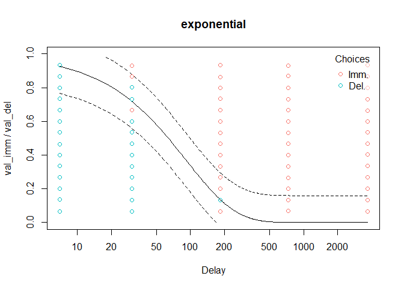
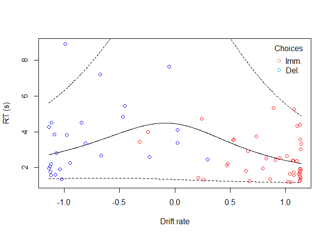

<!-- README.md is generated from README.Rmd. Please edit that file -->

# tempodisco

<!-- badges: start -->

[](https://github.com/kinleyid/tempodisco/actions/workflows/R-CMD-check.yaml)
[](https://codecov.io/github/kinleyid/tempodisco)
<!-- badges: end -->

`tempodisco` is an R package for working with delay discounting data.

## Installation

You can install tempodisco from [GitHub](https://github.com/) with:

``` r
# install.packages("devtools")
devtools::install_github("kinleyid/tempodisco")
```

## Example usage

``` r
library(tempodisco)
```

### Modeling indifference point data

To compute indifference points from an adjusting amount procedure, we
can use the `adj_amt_indiffs` function:

``` r
data("adj_amt_sim") # Load simulated data from an adjusting amounts procedure
indiff_data <- adj_amt_indiffs(adj_amt_sim)
head(indiff_data)
#>   del   indiff
#> 1   7 0.984375
#> 2  30 0.859375
#> 3  90 0.046875
#> 4 180 0.453125
#> 5 360 0.015625
```

This returns a data frame containing the delays and corresponding
indifference points. The function `td_ipm` can then be used to identify
the best-fitting discount function (according to the Bayesian
information criterion) from any subset of the following options:

| Name                                                                                         | Functional form                                         |
|----------------------------------------------------------------------------------------------|---------------------------------------------------------|
| Exponential ([Samuelson, 1937](https://doi.org/10.2307/2967612))                             | $f(t; k) = e^{-k t}$                                    |
| Scaled exponential (beta-delta; [Laibson, 1997](https://doi.org/10.1162/003355397555253))    | $f(t; k, w) = w e^{-k t}$                               |
| Nonlinear-time exponential ([Ebert & Prelec, 2007](https://doi.org/10.1287/mnsc.1060.0671))  | $f(t; k, s) = e^{-k t^s}$                               |
| Dual-systems exponential ([Ven den Bos & McClure, 2013](https://doi.org/10.1002/jeab.6))     | $f(t; k_1, k_2, w) = w e^{-k_1 t} + (1 - w) e^{-k_2 t}$ |
| Inverse q-exponential ([Green & Myerson, 2004](https://doi.org/10.1037/0033-2909.130.5.769)) | $f(t; k, s) = \frac{1}{(1 + k t)^s}$                    |
| Hyperbolic ([Mazur, 1987](https://doi.org/10.4324/9781315825502))                            | $f(t; k) = \frac{1}{1 + kt}$                            |
| Nonlinear-time hyperbolic ([Rachlin, 2006](https://doi.org/10.1901/jeab.2006.85-05))         | $f(t; k, s) = \frac{1}{1 + k t^s}$                      |

For example:

``` r
mod <- td_ipm(data = indiff_data, discount_function = c('exponential', 'hyperbolic', 'nonlinear-time-hyperbolic'))
print(mod)
#> 
#> Temporal discounting indifference point model
#> 
#> Discount function: hyperbolic, with coefficients:
#> 
#>          k 
#> 0.01767284 
#> 
#> ED50: 56.5840102782019
#> AUC: 0.313783753467372
```

From here, we can extract useful information about the model and
visualize it

``` r
plot(mod)
```


``` r
print(coef(mod)) # k value
#>          k 
#> 0.01767284
```

``` r
print(BIC(mod)) # Bayesian information criterion
#> [1] 1.937008
```

### Modeling binary choice data

A traditional method of modeling binary choice data is to compute a
value of $k$ using the scoring method introduced for the Kirby Monetary
Choice Questionnaire:

``` r
data("td_bc_single_ptpt")
```

``` r
mod <- kirby_score(td_bc_single_ptpt)
print(coef(mod))
#>          k 
#> 0.02176563
```

([Kirby, 1999](https://doi.org/10.1037/0096-3445.128.1.78))

Another option is to use the logistic regression method of Wileyto et
al., where we can solve for the $k$ value of the hyperbolic discount
function in terms of the regression coefficients:

``` r
mod <- wileyto_score(td_bc_single_ptpt)
#> Warning: glm.fit: fitted probabilities numerically 0 or 1 occurred
```

``` r
print(mod)
#> 
#> Temporal discounting binary choice linear model
#> 
#> Discount function: hyperbolic from model hyperbolic.1, with coefficients:
#> 
#>          k 
#> 0.04372626 
#> 
#> Call:  glm(formula = fml, family = binomial(link = "logit"), data = data)
#> 
#> Coefficients:
#>     .B1      .B2  
#> 0.49900  0.02182  
#> 
#> Degrees of Freedom: 70 Total (i.e. Null);  68 Residual
#> Null Deviance:       97.04 
#> Residual Deviance: 37.47     AIC: 41.47
```

([Wileyto et al., 2004](https://doi.org/10.3758/BF03195548))

We can extend this approach to a number of other discount functions
using the `method` argument to `td_bclm`:

| Name                         | Discount function                                                                                                  | Linear predictor                                                                                       | Parameters                                                        |
|------------------------------|--------------------------------------------------------------------------------------------------------------------|--------------------------------------------------------------------------------------------------------|-------------------------------------------------------------------|
| `hyperbolic.1`               | Hyperbolic ([Mazur, 1987](https://doi.org/10.4324/9781315825502)):<br><br>$\frac{1}{1 + kt}$                       | $\beta_1 \left(1 - \frac{v_D}{v_I} \right) + \beta_2 t$                                                | $k = \frac{\beta_2}{\beta_1}$                                     |
| `hyperbolic.2`               | ([Mazur, 1987](https://doi.org/10.4324/9781315825502)):<br><br>$\frac{1}{1 + kt}$                                  | $\beta_1\left( \sigma^{-1}\left[\frac{v_\mathcal{I}}{v_\mathcal{D}}\right] + \log t \right) + \beta_2$ | $k = e^\frac{\beta_2}{\beta_1}$                                   |
| `exponential.1`              | Exponential ([Samuelson, 1937](https://doi.org/10.2307/2967612)):<br><br>$e^{-kt}$                                 | $\beta_1 \log \frac{v_I}{v_D} + \beta_2 t$                                                             | $k = \frac{\beta_2}{\beta_1}$                                     |
| `exponential.2`              | Exponential ([Samuelson, 1937](https://doi.org/10.2307/2967612)):<br><br>$e^{-kt}$                                 | $\beta_1\left( G^{-1}\left[\frac{v_\mathcal{I}}{v_\mathcal{D}}\right] + \log t \right) + \beta_2$      | $k = e^\frac{\beta_2}{\beta_1}$                                   |
| `scaled-exponential`         | Scaled exponential (beta-delta; [Laibson, 1997](https://doi.org/10.1162/003355397555253)):<br><br>$w e^{-kt}$      | $\beta_1\log\frac{v_{I}}{v_{D}} + \beta_2 t + \beta_3$                                                 | $k = \frac{\beta_2}{\beta_1}$, $w = e^{-\frac{\beta_3}{\beta_1}}$ |
| `nonlinear-time-hyperbolic`  | Nonlinear-time hyperbolic ([Rachlin, 2006](https://doi.org/10.1901/jeab.2006.85-05)):<br><br>$\frac{1}{1 + k t^s}$ | $\beta_1 \sigma^{-1}\left[\frac{v_{I}}{v_{D}}\right] + \beta_2\log t + \beta_3$                        | $k = e^\frac{\beta_3}{\beta_1}$, $s = \frac{\beta_2}{\beta_1}$    |
| `nonlinear-time-exponential` | Nonlinear-time exponential ([Ebert & Prelec, 2007](https://doi.org/10.1287/mnsc.1060.0671)):<br><br>$e^{-kt^s}$    | $\beta_1 G^{-1}\left[\frac{v_\mathcal{I}}{v_\mathcal{D}}\right] + \beta_2\log t + \beta_3$             | $k = e^\frac{\beta_3}{\beta_1}$, $s = \frac{\beta_2}{\beta_1}$    |

Where $\sigma^{-1}[\cdot]$ is the logit function, or the quantile
function of a standard logistic distribution, and $G^{-1}[\cdot]$ is the
quantile function of a standard Gumbel distribution ([Kinley et al.,
2024](https://doi.org/10.31234/osf.io/y2fdh))

By setting `method = "all"` (the default), `td_bclm` tests all of the
above models and returns the best-fitting one, according to the Bayesian
information criterion:

``` r
mod <- td_bclm(td_bc_single_ptpt, model = 'all')
#> Warning: glm.fit: fitted probabilities numerically 0 or 1 occurred
#> Warning: glm.fit: fitted probabilities numerically 0 or 1 occurred
#> Warning: glm.fit: fitted probabilities numerically 0 or 1 occurred
```

``` r
print(mod)
#> 
#> Temporal discounting binary choice linear model
#> 
#> Discount function: exponential from model exponential.2, with coefficients:
#> 
#>          k 
#> 0.01003216 
#> 
#> Call:  glm(formula = fml, family = binomial(link = "logit"), data = data)
#> 
#> Coefficients:
#>     .B1      .B2  
#>   3.597  -16.553  
#> 
#> Degrees of Freedom: 70 Total (i.e. Null);  68 Residual
#> Null Deviance:       97.04 
#> Residual Deviance: 15.7  AIC: 19.7
```

We can explore an even wider range of discount functions using nonlinear
modeling with `td_bcnm`. When `discount_function = "all"` (the default),
all of the following models are tested and the best-fitting one
(according to the Bayesian information criterion) is returned:

| Name                                                                                         | Functional form                                         |
|----------------------------------------------------------------------------------------------|---------------------------------------------------------|
| Exponential ([Samuelson, 1937](https://doi.org/10.2307/2967612))                             | $f(t; k) = e^{-k t}$                                    |
| Scaled exponential (beta-delta; [Laibson, 1997](https://doi.org/10.1162/003355397555253))    | $f(t; k, w) = w e^{-k t}$                               |
| Nonlinear-time exponential ([Ebert & Prelec, 2007](https://doi.org/10.1287/mnsc.1060.0671))  | $f(t; k, s) = e^{-k t^s}$                               |
| Dual-systems exponential ([Ven den Bos & McClure, 2013](https://doi.org/10.1002/jeab.6))     | $f(t; k_1, k_2, w) = w e^{-k_1 t} + (1 - w) e^{-k_2 t}$ |
| Inverse q-exponential ([Green & Myerson, 2004](https://doi.org/10.1037/0033-2909.130.5.769)) | $f(t; k, s) = \frac{1}{(1 + k t)^s}$                    |
| Hyperbolic ([Mazur, 1987](https://doi.org/10.4324/9781315825502))                            | $f(t; k) = \frac{1}{1 + kt}$                            |
| Nonlinear-time hyperbolic ([Rachlin, 2006](https://doi.org/10.1901/jeab.2006.85-05))         | $f(t; k, s) = \frac{1}{1 + k t^s}$                      |

``` r
mod <- td_bcnm(td_bc_single_ptpt, discount_function = 'all')
plot(mod, log = 'x', verbose = F, p_lines = c(0.05, 0.95))
```



### Drift diffusion models

To model reaction times using a drift diffusion model, we can use
`td_ddm` (here, for speed, we are starting the optimization near optimal
values for this dataset):

``` r
ddm <- td_ddm(td_bc_single_ptpt, discount_function = 'exponential',
              v_par_starts = 0.01,
              beta_par_starts = 0.5,
              alpha_par_starts = 3.5,
              tau_par_starts = 0.9)
print(ddm)
#> 
#> Temporal discounting drift diffusion model
#> 
#> Discount function: exponential
#> Coefficients:
#> 
#>           k           v        beta       alpha         tau 
#> 0.009664986 0.008541880 0.591146000 3.501014882 0.903601241 
#> 
#> "none" transform applied to drift rates.
#> 
#> ED50: 71.7173522454106
#> AUC: 0.0283275204463082
#> BIC: 260.86822208669
```

Following [Peters & D’Esposito
(2020)](https://doi.org/10.1371/journal.pcbi.1007615), we can apply a
sigmoidal transform to the drift rate $\delta$ to improve model fit
using the argument `drift_transform = "sigmoid"`:

$$\delta' = v_\text{max} \left(\frac{2}{1 + e^{-\delta}} - 1\right)$$

``` r
ddm_sig <- td_ddm(td_bc_single_ptpt, discount_function = 'exponential',
              drift_transform = 'sigmoid',
              v_par_starts = 0.01,
              beta_par_starts = 0.5,
              alpha_par_starts = 3.5,
              tau_par_starts = 0.9)
coef(ddm_sig)
#>             k             v          beta         alpha           tau 
#>    0.01059955    0.03568827    0.58234627    3.85938224    0.83088464 
#> max_abs_drift 
#>    1.14207920
```

This introduces a new variable `max_abs_drift` ($v_\text{max}$ in the
equation above) controlling the absolute value of the maximum drift
rate.

We can use the model to predict reaction times and compare them to the
actual data:

``` r
pred_rts <- predict(ddm_sig, type = 'rt')
cor.test(pred_rts, td_bc_single_ptpt$rt)
#> 
#>  Pearson's product-moment correlation
#> 
#> data:  pred_rts and td_bc_single_ptpt$rt
#> t = 3.2509, df = 68, p-value = 0.001791
#> alternative hypothesis: true correlation is not equal to 0
#> 95 percent confidence interval:
#>  0.1442124 0.5539902
#> sample estimates:
#>       cor 
#> 0.3667584
```

We can also plot reaction times against the model’s predictions:

``` r
plot(ddm_sig, type = 'rt', confint = 0.8)
```



### The “model-free” discount function

In addition to the discount functions listed above, we can fit a
“model-free” discount function to the data, meaning we fit each
indifference point independently. This enables us to, first, test
whether a participant exhibits non-systematic discounting according to
the Johnson & Bickel criteria:

- C1 (monotonicity): No indifference point can exceed the previous by
  more than 0.2 (i.e., 20% of the larger delayed reward)
- C2 (minimal discounting): The last indifference point must be lower
  than first by at least 0.1 (i.e., 10% of the larger delayed reward)

([Johnson & Bickel, 2008](https://doi.org/10.1037/1064-1297.16.3.264))

``` r
mod <- td_bcnm(td_bc_single_ptpt, discount_function = 'model-free')
print(nonsys(mod)) # Model violates neither criterion; no non-systematic discounting detected
#>    C1    C2 
#> FALSE FALSE
```

We can also measure the model-free area under the curve (AUC), a useful
model-agnostic measure of discounting.

``` r
print(AUC(mod))
#> Defaulting to max_del = 3652.5
#> Assuming an indifference point of 1 at delay 0
#> Defaulting to val_del = 198.314285714286
#> [1] 0.03146756
```
