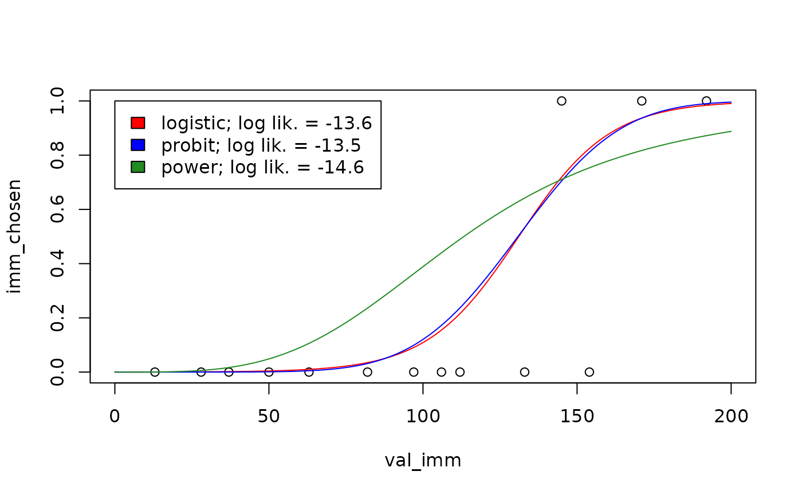
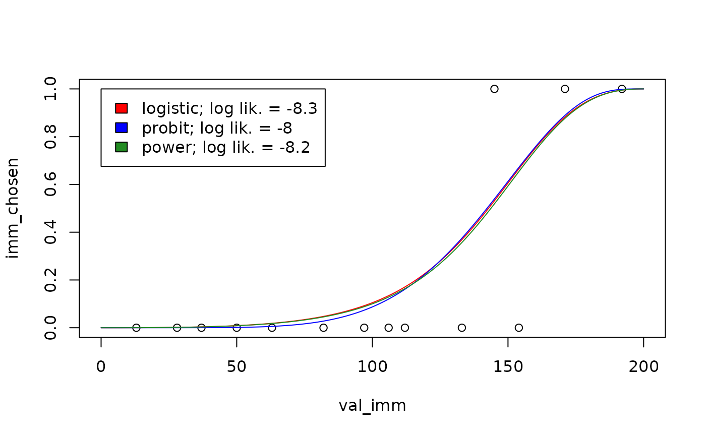
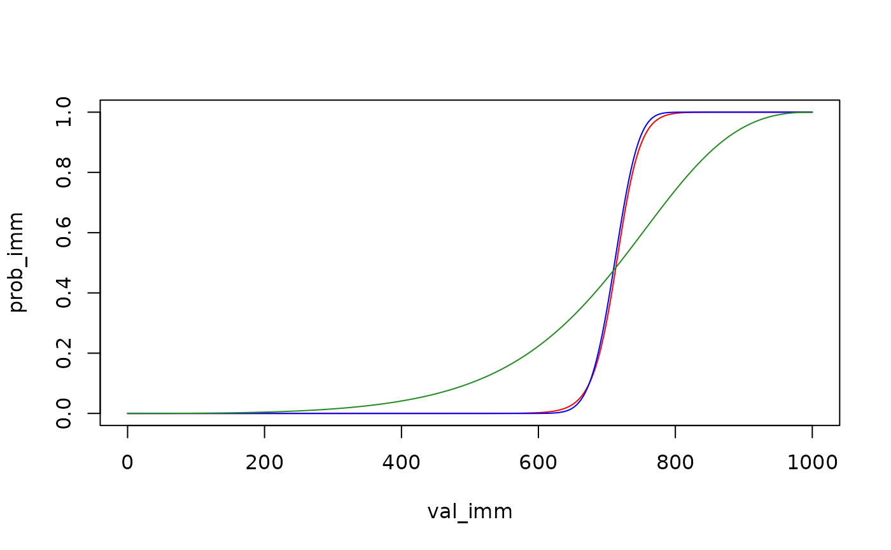

# Choice rules

``` r
library(tempodisco)
```

## Background

When [modeling binary choice
data](https://kinleyid.github.io/tempodisco/articles/modeling-binary-choice-data.html)
using
[`td_bcnm`](https://kinleyid.github.io/tempodisco/reference/td_bcnm.html),
not only the discount function but also the **choice rule** must be
specified. Whereas the discount function is parameterized to specify how
the subjective value of a future reward decreases with delay, the choice
rule is parameterized to specify the probability of choosing either of
two rewards whose subjective values are given. To illustrate,
`plot(... type = "summary")` visualizes the discount function:

``` r
# Load data and fit model
data("td_bc_single_ptpt")
mod <- td_bcnm(td_bc_single_ptpt, discount_function = "exponential")
# Plot the discount curve
plot(mod, type = "summary", verbose = F)
```


whereas `plot(... type = "endpoints")` visualizes the choice rule (i.e.,
the psychometric curve for a given combination of delay and delayed
reward value):

``` r
# Plot the choice rule
plot(mod, type = "endpoints", del = 50, val_del = 200, verbose = F)
```


Just as we can fit a [range of discount
functions](https://kinleyid.github.io/tempodisco/articles/comparing-models.html)
to the data, we can also fit several choice rules using the
`choice_rule` argument to `td_bcnm`. Mathematically, each choice rule
gives the probability of selecting the immediate reward, $P(I)$, given
the subjective values of the immediate and delayed rewards $SV_{I}$ and
$SV_{D}$ respectively (where $SV_{I}$ is simply the face value of the
immediate reward and $SV_{D}$ depends on the discount curve), and a
“sharpness” parameter $\gamma \geq 0$, where a larger $\gamma$ reflects
less “noisy” decision making. Built-in choice rules are listed below.

## Built-in choice rules

### Logistic

`choice_rule = "logistic"` (the default) gives the logistic choice rule:

$$P(I) = \sigma\left\lbrack \gamma\left( SV_{I} - SV_{D} \right) \right\rbrack$$

where $\sigma$ is the logistic function
$\sigma\lbrack x\rbrack = \left( 1 + \exp\{ - x\} \right)^{- 1}$, which
is the cumulative distribution function (CDF) of a logistic distribution
with location parameter 0 and scale parameter 1.

### Probit (normal)

`choice_rule = "probit"` gives the probit choice rule:

$$P(I) = \Phi\left\lbrack \gamma\left( SV_{I} - SV_{D} \right) \right\rbrack$$

where $\Phi$ is the CDF of the standard normal distribution.

### Power (log-logistic)

`choice_rule = "power"` gives the power choice rule ([Luce,
1959/2005](https://doi.org/10.1037/14396-000)):

$$P(I) = \frac{SV_{I}^{\gamma}}{SV_{I}^{\gamma} + SV_{D}^{\gamma}}$$

where the right hand side of the equation is the CDF of a log-logistic
distribution with scale parameter 1 and shape parameter $\gamma$.

## Comparing choice rules

Broadly speaking, the logistic and probit choice rules are similar—both
are based on a “Fechner model” ([Becker, DeGroot, & Marschak,
1963](https://doi.org/10.1002/bs.3830080106)) in which comparisons
between subjective reward values are “noisy”:

$$P(I) = \Pr\left( SV_{I} - SV_{D} < \varepsilon \right)$$

where the noise, represented by the random variable $\varepsilon$, is
assumed to follow either a logistic distribution for the logistic choice
rule, or a normal distribution for the probit choice rule. In contrast,
the power choice rule could be taken to imply the following Fechner-like
model:

$$P(I) = \Pr\left( \frac{SV_{I}}{SV_{D}} < \varepsilon \right)$$

where $\varepsilon$ is now assumed to follow a log-logistic
distribution. Mathematical details can be found in [Kinley, Oluwasola &
Becker (2025)](https://doi.org/10.1016/j.jmp.2025.102902).

These theoretical differences between the choice rules have the
following practical implications:

1.  In the logistic and probit choice rules, decisions are less
    stochastic (i.e., $\gamma$ is effectively higher) for larger reward
    magnitudes, whereas decision stochasticity is constant (i.e.,
    $\gamma$ is effectively constant) for the power choice rule. There
    is evidence that real human decision making is indeed less
    stochastic for larger reward values ([Gershman & Bhui,
    2020](https://doi.org/10.1038/s41467-020-16852-y)). However, it is
    not obvious that trying to capture this effect for data with a
    narrow range of reward magnitudes will improve model fit.
2.  For the logistic and probit choice rules, $P(I)$ is never exactly 0
    or 1. In contrast, for the power choice rule, $P(I) = 0$ when
    $SV_{I} = 0$. Thus, for the power choice rule, model fit will be
    strongly negatively impacted if a participant ever chose an
    immediate reward of 0. However, such decisions are arguably better
    used for attention checks than model fitting (see, for example,
    [Almog et al., 2023](https://doi.org/10.1037/pha0000645)).

To see the differences between the power choice rule on the one hand and
the logistic and probit choice rules on the other, we can visualize
their predictions for the same participant:

``` r
vis_del <- sort(unique(td_bc_single_ptpt$del))[2]
newdata <- data.frame(del = vis_del, val_del = 200, val_imm = seq(0, 200, length.out = 1000))
plot(imm_chosen ~ val_imm, data = subset(td_bc_single_ptpt, del == vis_del),
     xlim = c(0, 200), ylim = c(0, 1))
plot_legend <- c("red" = "logistic",
                 "blue" = "probit",
                 "forestgreen" = "power")
logLiks <- c()
for (entry in names(plot_legend)) {
  choice_rule <- plot_legend[entry]
  mod <- td_bcnm(td_bc_single_ptpt,
                 discount_function = "exponential",
                 choice_rule = choice_rule)
  logLiks[entry] <- logLik(mod)
  preds <- predict(mod, type = 'response', newdata = newdata)
  lines(preds ~ newdata$val_imm, col = entry)
}
legend(0, 1,
       fill = names(plot_legend),
       legend = paste(plot_legend, '; log lik. = ', round(logLiks, 1), sep = ''))
```



As suggested by the log likelihood measurements shown in the legend
above, the choice rule can significantly impact model fit ([Wulff & van
den Bos, 2017](https://doi.org/10.1177/0956797616664342)). Therefore it
is a good idea to explore multiple choice rules for a given dataset to
see which one best describes the data.

## Fixed-endpoint choice rules

As described earlier, for the power choice rule, the probability of
choosing an immediate reward of \$0 is 0. In that sense, the left
endpoint of the psychometric curve is “fixed” at 0. This is arguably an
advantage, if choosing an immediate reward of \$0 should be taken as a
failed attention check rather than a reflection of an individual’s true
preferences ([Kinley, Oluwasola & Becker,
2025](https://doi.org/10.1016/j.jmp.2025.102902)). Following this logic,
we can create choice rules in which both endpoints are fixed, i.e.,
where the probability of choosing \$0 is 0 and where the probability of
choosing \$*x* now over \$*x* at some delay is 1, for all *x*.

This option is available through the `fixed_ends` argument to `td_bcnm`.
To see its effect, we can re-fit the models from the plot above with
`fixed_ends = TRUE`:

``` r
vis_del <- sort(unique(td_bc_single_ptpt$del))[2]
vis_val_del <- 200
newdata <- data.frame(del = vis_del,
                      val_del = vis_val_del,
                      val_imm = seq(0, vis_val_del, length.out = 1000))
plot(imm_chosen ~ val_imm, data = subset(td_bc_single_ptpt, del == vis_del),
     xlim = c(0, vis_val_del), ylim = c(0, 1))
plot_legend <- c("red" = "logistic",
                 "blue" = "probit",
                 "forestgreen" = "power")
logLiks <- c()
for (entry in names(plot_legend)) {
  choice_rule <- plot_legend[entry]
  mod <- td_bcnm(td_bc_single_ptpt,
                 discount_function = "exponential",
                 fixed_ends = TRUE,                 # Fixed endpoints
                 choice_rule = choice_rule)
  logLiks[entry] <- logLik(mod)
  preds <- predict(mod, type = 'response', newdata = newdata)
  lines(preds ~ newdata$val_imm, col = entry)
}
legend(0, 1,
       fill = names(plot_legend),
       legend = paste(plot_legend, '; log lik. = ', round(logLiks, 1), sep = ''))
```



Note that the psychometric curves are no longer symmetrical about
$P(I) = 0.5$ for the logistic and probit choice rules. As before, there
is an important difference between the power choice rule and the others:
in the power choice rule, decisions do not become less stochastic for
larger reward magnitudes. To see this, we can re-plot the psychometric
curves above, but this time predicting what the choice probabilities
would be if the reward magnitudes were multiplied by 5:

``` r
vis_del <- sort(unique(td_bc_single_ptpt$del))[2]
vis_val_del <- 1000
newdata <- data.frame(del = vis_del,
                      val_del = vis_val_del,
                      val_imm = seq(0, vis_val_del, length.out = 1000))
plot(c(0, 1) ~ c(0, vis_val_del), type = "n",
     xlab = "val_imm", ylab = "prob_imm")
plot_legend <- c("red" = "logistic",
                 "blue" = "probit",
                 "forestgreen" = "power")
for (entry in names(plot_legend)) {
  choice_rule <- plot_legend[entry]
  mod <- td_bcnm(td_bc_single_ptpt,
                 discount_function = "exponential",
                 fixed_ends = TRUE,
                 choice_rule = choice_rule)
  preds <- predict(mod, type = 'response', newdata = newdata)
  lines(preds ~ newdata$val_imm, col = entry)
}
```



The psychometric curve for the power choice rule looks the same, while
the curves for the logistic and probit choice rules are substantially
steeper.

The mathematical details of how fixed-endpoint choice rules are
generated can be found in [Kinley, Oluwasola & Becker
(2025)](https://doi.org/10.1016/j.jmp.2025.102902). That paper finds
that fixed-endpoint choice rules improve model fit, but there is an
important caveat: although the best-fitting model for a given individual
(comparing across discount functions and choice rules) is often one with
a fixed-endpoint choice rule, this does **not** mean that using a
fixed-endpoint choice rule will improve model fit when a single discount
function is assumed across individuals. In fact, although we have not
tested this systematically, when a given discount function does not
provide a good fit to an individual’s data, using a fixed-endpoint
choice rule seems to often make the model fit **worse**.

> ⚠️ In other words, you **should not** run something like
> `td_bcnm(data = ..., discount_function = "hyperbolic", fixed_ends = TRUE)`.
> Instead, you should run `td_bcnm(data = ..., fixed_ends = TRUE)` to
> allow a range of discount functions to be compared.

For the examples above, we already knew that the data in
`td_bc_single_ptpt` was well fit by an exponential discount function,
and the model fit turned out to be improved by switching to a
fixed-endpoints choice rule. However, if we repeat the model fitting
using a hyperbolic discount function, which does not fit the data well,
a fixed-endpoint choice rule actually makes the model fit worse:

``` r
mod_free <- td_bcnm(td_bc_single_ptpt,
                    discount_function = "hyperbolic",
                    fixed_ends = FALSE)
mod_fixed <- td_bcnm(td_bc_single_ptpt,
                     discount_function = "hyperbolic",
                     fixed_ends = TRUE)
cat(sprintf('Log lik. with free endpoints: %.2f\n', logLik(mod_free)))
#> Log lik. with free endpoints: -13.59
cat(sprintf('Log lik. with fixed endpoints: %.2f\n', logLik(mod_fixed)))
#> Log lik. with fixed endpoints: -14.02
```

## Custom choice rules

The choice rules described above can be generalized as

$$P(I) = F\left( s(\gamma)\left\lbrack \tau\left( \frac{V_{I}}{V_{D}} \right) - \tau\left( \delta\left( t;\overset{\rightarrow}{p} \right) \right) \right\rbrack \right)$$

where $F( \cdot )$ is the CDF of the distribution of the decision noise
$\varepsilon$, $s( \cdot )$ is a scale function applied to $\gamma$, and
$\tau( \cdot )$ is some transformation. These three functions jointly
specify the choice rule, as described below. $V_{I}$ and $V_{D}$ are the
face (vs. subjective) values of the immediate and delayed rewards,
respectively, and $\delta\left( t;\overset{\rightarrow}{p} \right)$ is a
discount function $\delta$ parameterized by some vector of parameters
$\overset{\rightarrow}{p}$ and evaluated at delay $t$.

The functions $F( \cdot )$, $s( \cdot )$, and $\tau( \cdot )$ can be
specified using the arguments `noise_dist`, `gamma_scale`, and
`transform`, respectively, to `td_bcnm`. When using the argument
`choice_rule`, these three are pre-set internally as follows (assuming
`fixed_ends = FALSE`):

| `choice_rule` | `noise_dist`                              | `gamma_scale`                          | `transform`                 |
|---------------|-------------------------------------------|----------------------------------------|-----------------------------|
| `"logistic"`  | `"logis"`; $F( \cdot ) = \sigma( \cdot )$ | `"linear"`; $s(\gamma) = \gamma V_{D}$ | `"identity"`; $\tau(x) = x$ |
| `"probit"`    | `"norm"`; $F( \cdot ) = \Phi( \cdot )$    | `"linear"`; $s(\gamma) = \gamma V_{D}$ | `"identity"`; $\tau(x) = x$ |
| `"power"`     | `"logis"`; $F( \cdot ) = \sigma( \cdot )$ | `"none"`; $s(\gamma) = \gamma$         | `"log"`; $\tau(x) = \log x$ |

Note that `noise_dist` must be a string to which the prefixes `p` and
`q` can be prepended to refer to a probability distribution’s CDF and
quantile functions, respectively (e.g., `pnorm` is the CDF of the normal
distribution, `qlogis` is the quantile function of the logistic
distribution). Note also that fixed-endpoint versions of these choice
rules are generated by setting `transform = "noise_dist_quantile"`,
which results in $\tau(x) = F^{- 1}(x)$ (for an explanation, see
[Kinley, Oluwasola & Becker,
2025](https://doi.org/10.1016/j.jmp.2025.102902)).

When we set `noise_dist`, `gamma_scale`, and `transform` ourselves, the
arguments `choice_rule` and `fixed_ends` are ignored, allowing us to
generate custom choice rules as shown below.

### Example 1: Cauchit choice rule

To create a Cauchit choice rule (analogous to Cauchit regression in the
way the probit choice rule is analogous to probit regression), we could
use the same configuration as for the probit choice rule, but switch the
`noise_dist` to `"cauchy"`:

``` r
mod_cauchit <- td_bcnm(td_bc_single_ptpt,
                       discount_function = "exponential",
                       noise_dist = "cauchy",
                       gamma_scale = "linear",
                       transform = "identity")
plot(mod_cauchit, type = "endpoints", del = 50, val_del = 200)
```


The psychometric curve is now generated by a shifted and scaled arctan
function. We can create a fixed-endpoint variant of this choice rule by
setting `transform = "noise_dist_quantile"`:

``` r
mod_cauchit_fixed <- td_bcnm(td_bc_single_ptpt,
                             discount_function = "exponential",
                             noise_dist = "cauchy",
                             gamma_scale = "linear",
                             transform = "noise_dist_quantile")
plot(mod_cauchit_fixed, type = "endpoints", del = 50, val_del = 200)
```


### Example 2: log-normal choice rule

In the same way that the power choice rule is based on the log-logistic
distribution, we can create a choice rule based on the log-normal
distribution as follows:

``` r
mod_lognormal <- td_bcnm(td_bc_single_ptpt,
                         discount_function = "exponential",
                         noise_dist = "norm",
                         gamma_scale = "none",
                         transform = "log")
plot(mod_lognormal, type = "endpoints", del = 50, val_del = 200)
```


As with the power choice rule, the left endpoint of the psychometric
curve is fixed, i.e., $P(I) = 0$ when $V_{I} = 0$.
