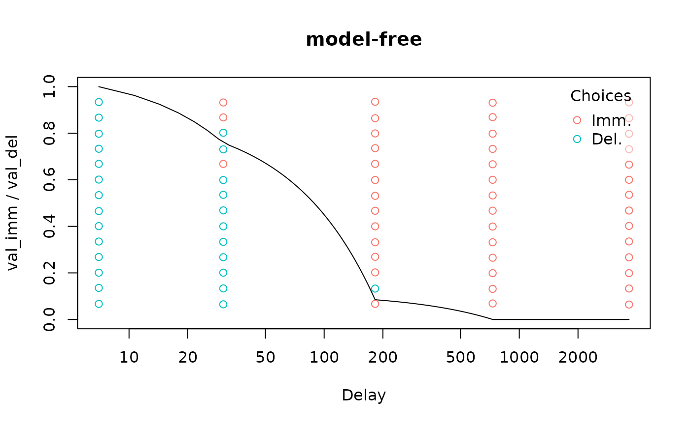

# Indentifying non-systematic discounting

``` r
library(tempodisco)
```

The Johnson & Bickel criteria are often used to determine whether an
individual exhibits “non-systematic” discounting:

- C1 (monotonicity): No indifference point can exceed the previous by
  more than 0.2 (i.e., 20% of the larger delayed reward)
- C2 (minimal discounting): The last indifference point must be lower
  than first by at least 0.1 (i.e., 10% of the larger delayed reward)

([Johnson & Bickel, 2008](https://doi.org/10.1037/1064-1297.16.3.264))

To check for non-systematic discounting, we first need to fit a
“model-free” discount function to our data. Other discount functions are
guaranteed monotonically decreasing, meaning the first criterion
(non-monotonic discounting) can’t ever be met.

``` r
data("adj_amt_sim")
df <- adj_amt_indiffs(adj_amt_sim)
mod <- td_ipm(df, discount_function = 'model-free')
plot(mod, verbose = F)
```


As we can see, this data meets the first criterion for non-systematicity
but not the second:

``` r
nonsys(mod)
#>    C1    C2 
#>  TRUE FALSE
```

We can do the same thing for binary choice data:

``` r
data("td_bc_single_ptpt")
mod <- td_bcnm(td_bc_single_ptpt, discount_function = 'model-free')
plot(mod, log = 'x', verbose = F)
```



This data meets neither criterion:

``` r
nonsys(mod)
#>    C1    C2 
#> FALSE FALSE
```
