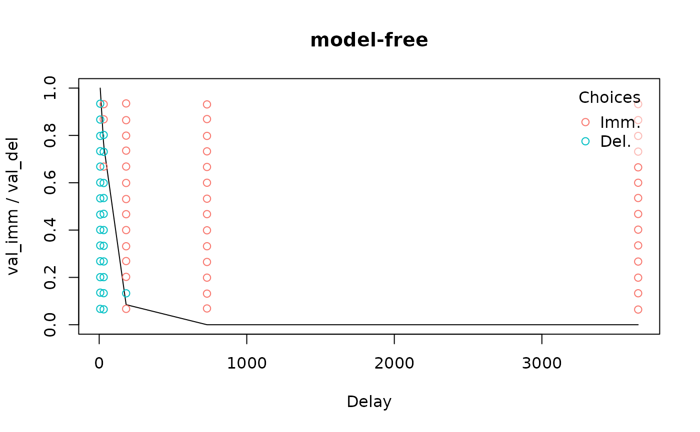

# Getting started

``` r
library(tempodisco)
```

This vignette briefly goes over the main steps involved in analyzing
delay discounting data. These topics are covered in greater depth in
other vignettes and in the documentation of the relevant functions.

## Loading data

`tempodisco` includes several example datasets. We will load one example
from a simulated “adjusting amounts” procedure ([Frye et al.,
2016](https://doi.org/10.3791/53584)), and one from a procedure in which
choices were not structured according to such a procedure.

``` r
data("adj_amt_sim") # Load simulated choice data from an adjusting amounts procedure
head(adj_amt_sim)
#>   del val_del val_imm imm_chosen trial_idx
#> 1   7     800     400      FALSE         1
#> 2   7     800     600      FALSE         2
#> 3   7     800     700      FALSE         3
#> 4   7     800     750      FALSE         4
#> 5   7     800     775      FALSE         5
#> 6  30     800     400      FALSE         6
data("td_bc_single_ptpt") # Load choice data from a non-adjusting-amounts experiment
head(td_bc_single_ptpt)
#>                                   id val_imm val_del       del imm_chosen    rt
#> 1 61dcacaa5ed72-dd-61dcb234e8a1c.txt     112     187   30.4167      FALSE 5.435
#> 2 61dcacaa5ed72-dd-61dcb234e8a1c.txt      50     187   30.4167      FALSE 1.913
#> 3 61dcacaa5ed72-dd-61dcb234e8a1c.txt      37     186 3652.5000       TRUE 2.931
#> 4 61dcacaa5ed72-dd-61dcb234e8a1c.txt      28     211  182.5000      FALSE 7.639
#> 5 61dcacaa5ed72-dd-61dcb234e8a1c.txt      53     197  182.5000       TRUE 2.129
#> 6 61dcacaa5ed72-dd-61dcb234e8a1c.txt      98     184  730.5000       TRUE 1.569
```

For each dataset, there are rows containing the values of the immediate
and delayed rewards, the delay of the delayed reward, and whether the
immediate reward was chosen. To use the functions in `tempodisco`, your
own data will need these same columns named in the same way.

## Computing indifference points

For the adjusting amounts data, we can use the `adj_amt_indiffs`
function to compute indifference points at each delay:

``` r
indiff_data <- adj_amt_indiffs(adj_amt_sim)
head(indiff_data)
#>   del   indiff
#> 1   7 0.984375
#> 2  30 0.859375
#> 3  90 0.046875
#> 4 180 0.453125
#> 5 360 0.015625
```

For non-adjusting-amounts data, we can use a form of logistic regression
that models each indifference point as the point at which a participant
has a 50% estimated probability of selecting the immediate or delayed
reward:

``` r
indiff_mod <- td_bcnm(td_bc_single_ptpt, discount_function = 'model-free')
plot(indiff_mod, verbose = F)
```



## Data quality checks

We can test for non-systematic discounting per the criteria of [Johnson
& Bickel (2008)](https://doi.org/10.1037/1064-1297.16.3.264) using the
`nonsys` function:

``` r
print(nonsys(indiff_data)) # Fails criterion 1 (monotonicity)
#>    C1    C2 
#>  TRUE FALSE
print(nonsys(indiff_mod))
#>    C1    C2 
#> FALSE FALSE
```

## Measuring discounting

To quantify discounting given a set of indifference points, we can use
the “area under the curve” measure ([Myerson et al.,
2001](https://doi.org/10.1901/jeab.2001.76-235)). The lower this measure
is, the steeper an individual’s delay discounting.

``` r
AUC(indiff_data)
#> [1] 0.3333984
AUC(indiff_mod)
#> [1] 0.03146756
```

## Fitting discount functions

Fitting a discount function to a set of indifference points can be done
using the `td_ipm` function:

``` r
hyperbolic_mod <- td_ipm(indiff_data, discount_function = 'hyperbolic')
plot(hyperbolic_mod)
```


``` r
coef(hyperbolic_mod)
#>          k 
#> 0.01767316
```

In contrast, fitting a discount function to choice-level data involves a
form of logistic regression where, as before, the indifference points
(determined by a discount function) are the points where the individual
has a 50% estimated probability of selecting the immediate vs delayed
reward.

``` r
hyperbolic_mod <- td_bcnm(td_bc_single_ptpt, discount_function = 'hyperbolic')
plot(hyperbolic_mod, verbose = F)
```


``` r
coef(hyperbolic_mod)
#>          k      gamma 
#> 0.01728009 0.06758106
```

From here, we can extract the $k$ values from the best-fitting
hyperbolic discount curves for each participant and use these as a
measure of discounting (higher $k$ means steeper discounting).
