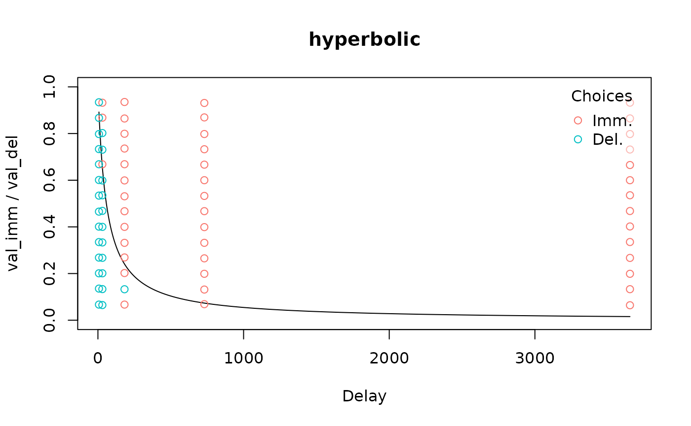
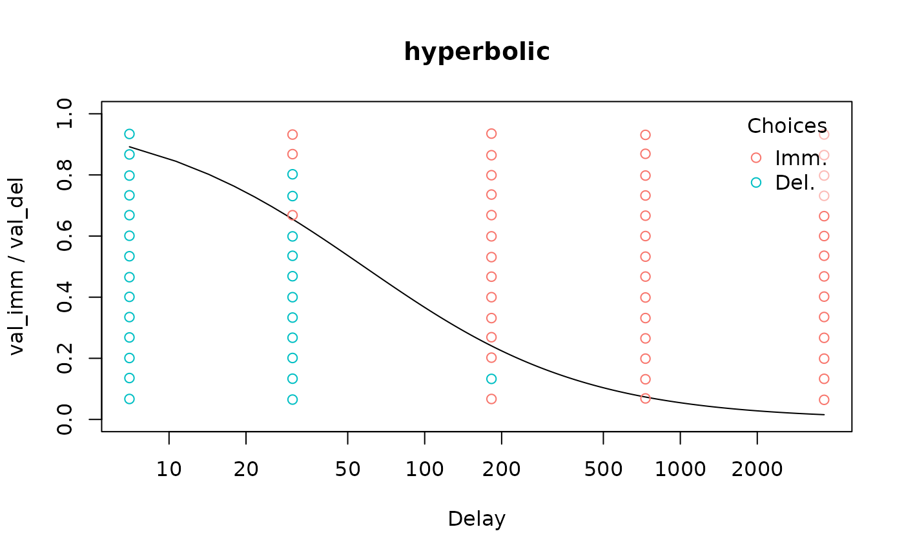
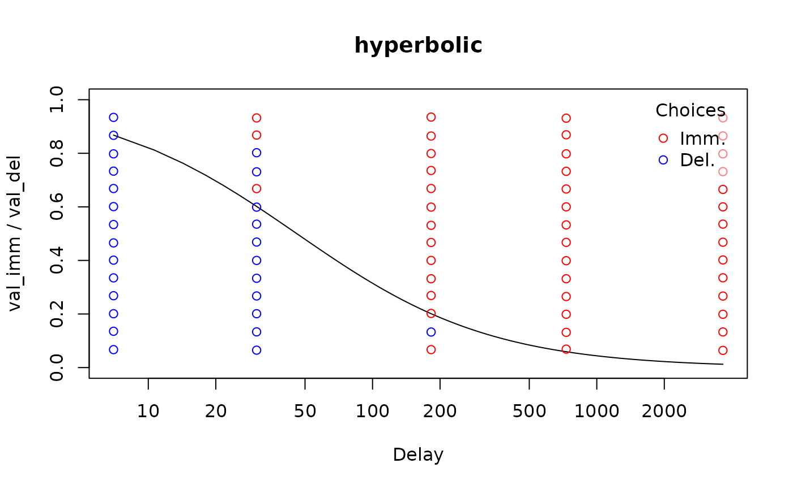
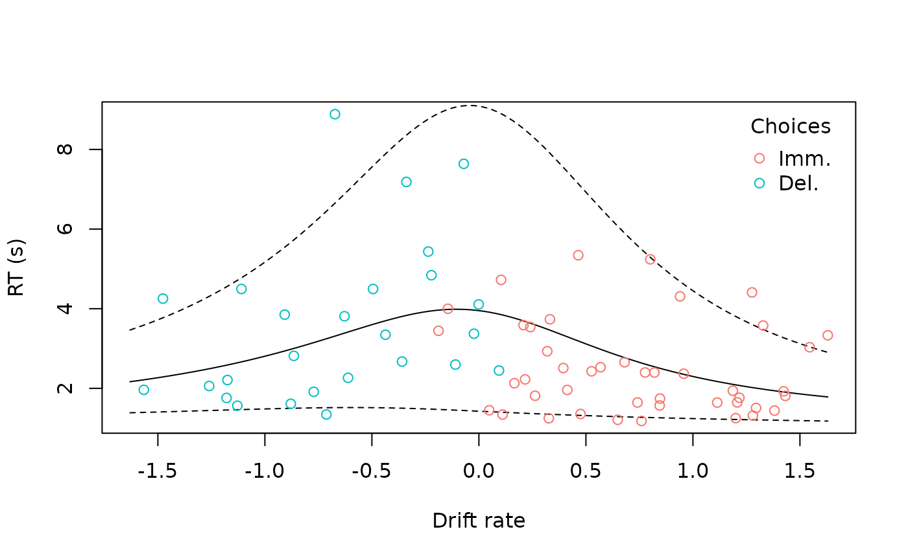

# Visualizing models

``` r
library(tempodisco)
```

We can visually inspect models using 4 types of plots, controlled by the
`type` argument to
[`plot()`](https://rdrr.io/r/graphics/plot.default.html). These plots
use base R graphics and are intended to be generated quickly (e.g., in a
loop over participants) to provide an easy visual check of model fit.
Publication-quality visualizations can be more readily generated using a
dedicated plotting package such as
[`ggplot2`](https://ggplot2.tidyverse.org/).

## `"summary"` plots

For a binary choice model, a “summary” plot displays both the binary
choices and the discount curve:

``` r
data("td_bc_single_ptpt")
mod <- td_bcnm(td_bc_single_ptpt, discount_function = 'hyperbolic')
plot(mod, type = 'summary')
#> Plotting indifference curve for val_del = 198.314285714286 (mean of val_del from data used to fit model). Override this behaviour by setting the `val_del` argument to plot() or set verbose = F to suppress this message.
```



The plotting function prints some info, telling us it is plotting the
discount curve corresponding to the average delayed reward value from
the data used for fitting the model. This is only relevant if the
discount curve depends on the delayed reward value (i.e., if magnitude
effects are accounted for). In this case the magnitude effect is not
accounted for, so we can suppress this message using `verbose = F`. We
can also log-transform the x-axis to achieve a more even spread between
the delays:

``` r
plot(mod, type = 'summary', verbose = F, log = 'x')
```



Additionally, we can plot some information about how stochastic the
individual’s decision making was. The discount curve shows where the
probability of selecting the immediate reward is predicted to be 50%,
but we can plot curves for other probabilities as well. For example, we
can show where the probability of selecting the immediate reward is 10%
and 90% by setting `p_lines = c(0.1, 0.9)`. For more stochastic decision
makers, there will be a greater separation between these (note that this
is *not* a confidence interval for the discount curve itself):

``` r
plot(mod, type = 'summary', verbose = F, log = 'x', p_lines = c(0.1, 0.9))
```


For an indifference point model, the discount function is usually
plotted alongside the empirical indifference points:

``` r
data("td_ip_simulated_ptpt")
mod_ip <- td_ipm(td_ip_simulated_ptpt, discount_function = 'hyperbolic')
plot(mod_ip, type = 'summary', log = 'x', verbose = F)
```


The only exception to this is an indifference point model produced by
Kirby scoring, which applies to binary choice data. In this case, the
binary choices are displayed.

``` r
mod_ip <- kirby_score(td_bc_single_ptpt)
plot(mod_ip, type = 'summary', log = 'x', verbose = F)
```



However, because indifference point models don’t explicitly model the
probabilities of individual choices, the other plot types are not
applicable to them.

## `"endpoints"` plots

To visualize how stochastic the decision maker was, we can set
`type = 'endpoints'`. This plots a psychometric curve of the probability
of selecting the immediate reward as a function of its value relative to
the delayed reward, (i.e., from 0 to 1, the “endpoints” for which the
plot type is named):

``` r
plot(mod, type = 'endpoints')
#> gamma parameter (steepness of psychometric curve curve) is scaled by val_del.
#> Thus, the curve will have different steepness for a different value of val_del.
#> Defaulting to val_del = 198.314285714286 (mean of val_del from data used to fit model).
#> Use the `val_del` argument to specify a custom value or use verbose = F to suppress this message.
#> Setting del = 57.8700610123057 (ED50) to center the curve.
#> This can be changed using the `del` argument.
```


This time we get some relevant messages. First, this curve is centered
by default (it corresponds to the delay at which the indifference point
is 0.5). Second, it corresponds to the average delayed reward value from
the data used for fitting the model. The “logistic” choice rule (used by
default) assumes that the “sharpness” of the psychometric curve
increases for higher reward values. We can customize these using the
`del` and `val_del` arguments:

``` r
del <- sort(unique(mod$data$del))[2]
plot(mod, type = 'endpoints', del = del, val_del = 1000)
```


Note that when `del` corresponds to one of the delays in the data, the
binary choices corresponding to that delay are included in the plot as
points on the y = 0 and y = 1 lines.

## `"link"` plots

Finally, we can plot the probability of selecting the immediate reward
against the values of the link function. This is potentially useful for
visually detecting outliers.

``` r
plot(mod, type = 'link')
```


## “`rt`” plots

For drift [diffusion
models](https://kinleyid.github.io/tempodisco/articles/drift-diffusion-models.md),
we can create a plot of reaction times against the model’s predictions:

``` r
ddm <- td_ddm(td_bc_single_ptpt, discount_function = 'exponential',
              gamma_par_starts = 0.01,
              beta_par_starts = 0.5,
              alpha_par_starts = 3.5,
              tau_par_starts = 0.9)
plot(ddm, type = 'rt', q_lines = c(0.05, 0.95), legend = T)
```



Here, we have selected to also view a 90% quantile-based confidence
interval around the model’s predictions.
